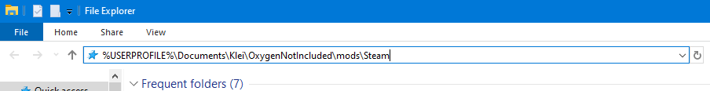
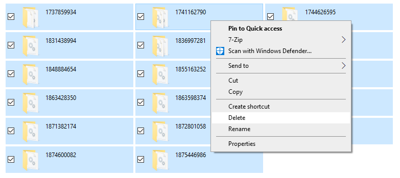
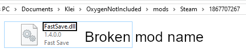

# Clearing the Local Mod Cache (Forcing Auto-Update)

The Steam Workshop is intended to automatically update mods. However, arbitrary users will sometimes not receive updates due to recent issues with Steam. Clearing the mod cache will resolve many such issues.

## Navigate to the Steam mods folder

Close Oxygen Not Included, but leave Steam running.

* Enter `%USERPROFILE%\Documents\Klei\OxygenNotIncluded\mods\Steam` into Windows Explorer.
* Enter `~/Klei/OxygenNotIncluded/mods/Steam` into a file explorer on Mac OS or Linux.

## Clear the mod cache for all mods

If you are unsure which mod is not updating properly, delete all of the folders shown. *Custom settings for mods may be lost*.

## Clear the mod cache for a specific mod

If a specific mod is causing problems, look through each folder for the problem mod(s). Mods have their name replaced with the Steam content ID, so it may take some investigation to locate the correct mod. For example, *Fast Save* has the mod ID `1867707267`.

Once the desired mod is found, delete all files in that folder. If the configuration of the mod should be saved, avoid deleting any files named `Config.json` or `config.json`.

