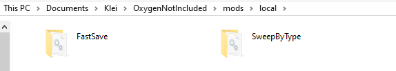

# Peter Han&#39;s Mods for Oxygen Not Included

Last tested on game version: **U43-526233**

**No support** for Public Testing branches, including the rolled back Legacy Vanilla (CS-469300).

Steam Workshop: https://steamcommunity.com/profiles/76561198025154321/myworkshopfiles/?appid=457140

## Local Downloads

Steam users: Before trying a local download or reporting an issue, use [Mod Updater](https://steamcommunity.com/sharedfiles/filedetails/?id=2018291283) to see if the mod is out of date.

Steam sometimes serves outdated mod versions, and Oxygen Not Included is also available on the Epic Games Store.
Local copies of these mods are available in the [Releases](https://github.com/peterhaneve/ONIMods/releases/tag/ModsLatest) section.
These mods should be installed into the `local` folder, creating it if it does not already exist.
Mods should remain in their own subfolder.

* Windows: `%USERPROFILE%\Documents\Klei\OxygenNotIncluded\mods\local`
  Replace the documents path with the path to your `Documents` folder if this folder has been redirected.
* Mac OS: `/Users/user name/Library/Application Support/unity.Klei.Oxygen Not Included/mods/Local`
  Replace `user name` with your user name.
* Linux: `~/.config/unity3d/Klei/Oxygen Not Included/mods/Local`

**Do not use a Steam copy and a local copy of the same mod at the same time.** Disable the Steam version in the mods list before activating any local copies.

# Mod List

## Minor Updates - No Mechanics Changes
|  **Name**  |  **Description**  |  **Vanilla**  |  **Spaced Out! DLC**  |
| :--------: | :---------------: | :-----------: | :-------------------: |
| [Auto-Eject](https://steamcommunity.com/sharedfiles/filedetails/?id=2551341883) | Automatically completes the Neural Vacillator and Teleport tasks | Yes | Yes |
| [Claustrophobia](https://steamcommunity.com/sharedfiles/filedetails/?id=1836997281) | Deprecated! No longer supported. | No | No |
| [Clean Drop](https://steamcommunity.com/sharedfiles/filedetails/?id=2047364442) | Pushes items spawned inside tiles into a location accessible to Duplicants | Yes | Yes |
| [Critter Inventory](https://steamcommunity.com/sharedfiles/filedetails/?id=1831438994) | Adds tame and wild critters to the inventory list | Yes | Yes |
| [Custom Pipe Colors](https://steamcommunity.com/sharedfiles/filedetails/?id=2167499088) | Restores the old Insulated Pipe overlay color and allows configuring custom colors | Yes | Yes |
| [Deselect New Materials](https://steamcommunity.com/sharedfiles/filedetails/?id=1863598374) | Optionally deselects newly discovered materials from storage buildings | Yes | Yes |
| [Efficient Supply](https://steamcommunity.com/sharedfiles/filedetails/?id=1874600082) | Optimizes Supply errands to prevent inefficient uses of tiny item stacks | Yes | Yes |
| [Falling Sand](https://steamcommunity.com/sharedfiles/filedetails/?id=1855163252) | Automatically places Dig errands on fallen unstable tiles caused by mining | Yes | Yes |
| [Fast Save](https://steamcommunity.com/sharedfiles/filedetails/?id=1867707267) | Improves performance when loading, saving, or automatically saving the game | Yes | Yes |
| [Food Supply Tooltips](https://steamcommunity.com/sharedfiles/filedetails/?id=1914501780) | Adds tooltips to food sources indicating their calorie production per cycle | Yes | Yes |
| [Mismatched Wire Finder](https://steamcommunity.com/sharedfiles/filedetails/?id=2607620648) | Finds wires and pipes that do not match the rest of their network | Yes | Yes |
| [Mod Updater](https://steamcommunity.com/sharedfiles/filedetails/?id=2018291283) | Updates mods that Steam leaves at old versions | Yes | Yes |
| [No Splash Screen](https://steamcommunity.com/sharedfiles/filedetails/?id=2361698345) | Hides the Early Access splash screen | Yes | Yes |
| [Not Enough Tags](https://steamcommunity.com/sharedfiles/filedetails/?id=2230218796) | Fixes Tag exhaustion in large bases | Yes | Yes |
| [Pip Plant Overlay](https://steamcommunity.com/sharedfiles/filedetails/?id=2493100777) | Adds an overlay showing where Pips can plant seeds | Yes | Yes |
| [Popup Control](https://steamcommunity.com/sharedfiles/filedetails/?id=2032187035) | Shows or hides text info popups for each source | Yes | Yes |
| [Reloading In Motion](https://steamcommunity.com/sharedfiles/filedetails/?id=2182976959) | Deprecated! No longer supported. | No | No |
| [Research Queue](https://steamcommunity.com/sharedfiles/filedetails/?id=1893887916) | Allows queueing of multiple technologies to research | Yes | Yes |
| [Sandbox Tools](https://steamcommunity.com/sharedfiles/filedetails/?id=1928837153) | Improves the Sandbox mode with new spawnable items and other small tweaks | Yes | Yes |
| [Settings Change Tool](https://steamcommunity.com/sharedfiles/filedetails/?id=1843647561) | Changes Repair, Disinfect, and Enable settings on multiple buildings at once | Yes | Yes |
| [Show Building Ranges](https://steamcommunity.com/sharedfiles/filedetails/?id=1960996649) | Shows the active range of many buildings while selected or being placed | Yes | Yes |
| [Starmap Queue](https://steamcommunity.com/sharedfiles/filedetails/?id=1907780517) | Automatically selects new destinations to be analyzed when the Telescope finishes research | Yes | No |
| [Stock Bug Fix](https://steamcommunity.com/sharedfiles/filedetails/?id=1967921388) | Fixes some annoying bugs in the base game | Yes | Yes |
| [Sweep By Type](https://steamcommunity.com/sharedfiles/filedetails/?id=1863428350) | Filters the Sweep tool to sweep only selected item types | Yes | Yes |
| [Thermal Tooltips](https://steamcommunity.com/sharedfiles/filedetails/?id=1983504552) | Displays expanded thermal information tooltips in the Temperature Overlay | Yes | Yes |

## New Features
|  **Name**  |  **Description**  |  **Vanilla**  |  **Spaced Out! DLC**  |
| :--------: | :---------------: | :-----------: | :-------------------: |
| [100K Challenge](https://steamcommunity.com/sharedfiles/filedetails/?id=2228381429) | A frigid map with an average temperature of 100 K (-173 C) | Yes | No |
| [AI Improvements](https://steamcommunity.com/sharedfiles/filedetails/?id=2128885110) | Improves Duplicant AI to reduce cases of stuck Duplicants | Yes | Yes |
| [Airlock Door](https://steamcommunity.com/sharedfiles/filedetails/?id=2094698134) | A door allowing Duplicants to pass while maintaining full atmospheric isolation | Yes | Yes |
| [Build Straight Up](https://steamcommunity.com/sharedfiles/filedetails/?id=2135682628) | Allows Rockets and Monuments to be planned out all at once | Yes | Yes |
| [Forbid Items](https://steamcommunity.com/sharedfiles/filedetails/?id=2834936494) | Prevent specified items from being picked up by Duplicants or Auto-Sweepers | Yes | Yes |
| [Moo Reproduction](https://steamcommunity.com/sharedfiles/filedetails/?id=2400500058) | Allows Gassy Moos to reproduce by live birth with multiple in one ranch | No | Yes |
| [No Sensor Limits](https://steamcommunity.com/sharedfiles/filedetails/?id=2277619848) | Increases the maximum threshold limits on most Automation sensors | Yes | Yes |
| [One Giant Leap](https://steamcommunity.com/sharedfiles/filedetails/?id=1999001228) | Adds over 30 new, challenging Colony Initiatives | Yes | Yes |
| [Rest for the Weary](https://discord.com/channels/282741876224688128/668969434374995986/803066413237141545) | Adds a Schedule block where Duplicants may finish current tasks, but not start new ones | Yes | Yes |
| [Queue for Sinks](https://steamcommunity.com/sharedfiles/filedetails/?id=1881925531) | Causes Duplicants to automatically line up to use sinks, wash basins, hand sanitizers, and ore scrubbers | Yes | Yes |
| [Smart Pumps](https://forums.kleientertainment.com/forums/topic/91094-the-mystery-about-pump-range/) | Adds new, smarter liquid and gas pumps for specific situations | Yes | Yes |
| [Thermal Interface Plate](https://steamcommunity.com/sharedfiles/filedetails/?id=1938747693) | Transfers heat between buildings in its tile, even in a complete Vacuum | Yes | Yes |
| [Thermo Sensor Tile](https://steamcommunity.com/sharedfiles/filedetails/?id=1974008313) | A Thermo Sensor in tile form for effective heat measurement of adjacent tiles | Yes | Yes |
| [Turn Back the Clock](https://steamcommunity.com/sharedfiles/filedetails/?id=2553917491) | Revert gameplay changes to play mature colonies under legacy mechanics | Yes | No |
| [Waste Not, Want Not](https://steamcommunity.com/sharedfiles/filedetails/?id=2567122431) | Make Duplicants prefer older leftovers to minimize food waste | Yes | Yes |

## Reimagination Team Mods

|  **Name**  |  **Description**  |  **Vanilla**  |  **Spaced Out! DLC**  |
| :--------: | :---------------: | :-----------: | :-------------------: |
| [Decor Reimagined](https://steamcommunity.com/sharedfiles/filedetails/?id=1892161928) | Reimagines decor, rewarding bases with consistent, unique decor items | Yes | Yes |
| [Diseases Restored](https://steamcommunity.com/sharedfiles/filedetails/?id=1911357229) | Restores diseases making germs more dangerous again, and adds methods to deal with germ spread | Yes | No |
| [Traits Reworked](https://steamcommunity.com/sharedfiles/filedetails/?id=1905214098) | Reworks Duplicant traits to make all traits meaningful and the most extreme traits more sensible | Yes | No |

# Compiling this repository

After cloning the repository, if Oxygen Not Included is stored in a different directory than the default (`C:\Program Files (x86)\Steam\steamapps\common`), create a copy of `Directory.Build.props.default` named `Directory.Build.props.user`. Modify the values in it to match the correct folder locations. The "legacy" game folder is only used for pre-Mergedown versions of the game and can usually be safely ignored.

The project is currently built against Visual Studio 2022 and the .NET Framework 4.7.1 (as required by the game). Make sure that the correct targeting packs, as well as MSBuild support, are installed in the Visual Studio Installer.
